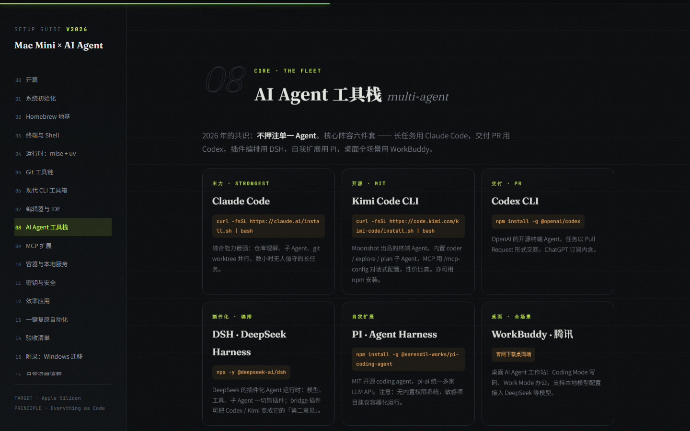
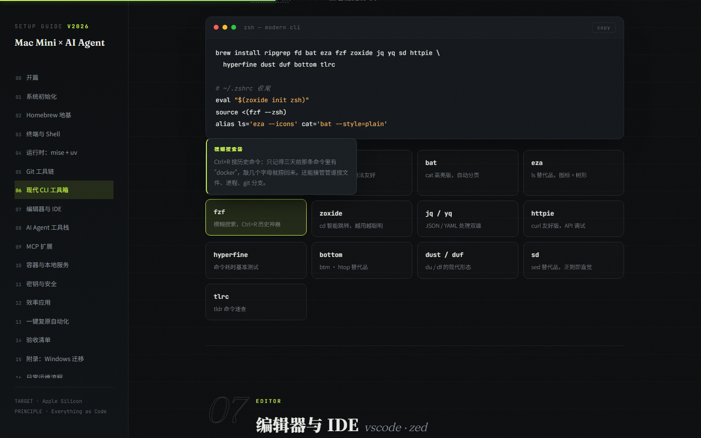

<div align="center">

# 🖥️ Mac × AI Agent — The Complete Dev Environment Guide

**The Ultimate macOS Setup for AI-Agent-Driven Development (2026)**

Build a modern, reproducible, fully-configurable development environment<br>
on any Apple Silicon Mac — MacBook / iMac / Mac Studio / Mac Mini

[](https://www.apple.com/macos/)
[](https://brew.sh/)
[](https://www.chezmoi.io/)
[](https://github.com/x5/new-mac-setting)
[](LICENSE)
[](CHANGELOG.md)
[](https://github.com/x5/new-mac-setting/pulls)
[](https://x5.github.io/new-mac-setting/mac-mini-ai-dev-setup.html)

### 🌐 [Read the beautiful single-page edition →](https://x5.github.io/new-mac-setting/mac-mini-ai-dev-setup.html)

[中文请往下翻](#-中文版) · [Full Manual (EN)](mac-mini-ai-dev-setup.md) · [完整手册（中文）](mac-mini-ai-dev-setup.zh-CN.md) · [Changelog](CHANGELOG.md) · [References](#-references)

</div>

---


## ✨ What This Is

A 2026-perspective Mac setup handbook covering the **entire lifecycle** of a new machine:

```
Setup (§1-12)  →  Codify (§13)  →  Verify (§14)  →  Migrate from Windows (§15)  →  Day-2 Ops (§16)
```

Three core principles:

- 📜 **Everything as code** — Brewfile + dotfiles + bootstrap script; restore a new machine in 30 minutes
- ⌨️ **Terminal-first** — the AI agent battleground: Ghostty + zsh + Starship + Nerd Font
- 🤖 **Multi-agent fleet** — Claude Code / Kimi Code / Codex / DSH / PI / WorkBuddy / ZCode, picked per task, with cc-switch as the unified provider switcher

## 📖 Formats

| File | Description |
|---|---|
| 📄 [`mac-mini-ai-dev-setup.md`](mac-mini-ai-dev-setup.md) · [中文](mac-mini-ai-dev-setup.zh-CN.md) | The full manual. 16 chapters + glossary footnotes, executable section by section |
| 🎨 [`mac-mini-ai-dev-setup.html`](mac-mini-ai-dev-setup.html) · [🌐 Online](https://x5.github.io/new-mac-setting/mac-mini-ai-dev-setup.html) · [中文版](https://x5.github.io/new-mac-setting/mac-mini-ai-dev-setup.zh-CN.html) | Same content as a polished single page: dark terminal aesthetic, chapter nav, hover term tooltips, one-click code copy |

| Agent Fleet | Hover Tooltips |
|---|---|
|  |  |

## 🗺️ Chapters

| # | Chapter | Highlights |
|---|---|---|
| 01 | 🍎 System Init | FileVault, `defaults write`, Xcode CLT |
| 02 | 🍺 Homebrew Foundation | everything via brew, no GUI installs |
| 03 | 💻 Terminal & Shell | Ghostty + zsh + Starship + Nerd Font |
| 04 | 🔄 Runtimes | mise (replaces nvm/pyenv & co) + uv |
| 05 | 🌿 Git Toolchain | gh, lazygit, git-delta, worktree |
| 06 | 🧰 Modern CLI Toolbox | ripgrep / fd / bat / eza / fzf / zoxide … 13 tools, all cross-platform |
| 07 | 📝 Editors | VS Code primary + Zed lightweight |
| 08 | 🤖 AI Agent Fleet | 7 agents + cc-switch provider switcher |
| 09 | 🔌 MCP | Playwright / Context7 / GitHub / Figma, install on demand |
| 10 | 🐳 Containers | OrbStack replaces Docker Desktop |
| 11 | 🔐 Secrets | free-first: Keychain + direnv + age/sops; 1Password optional |
| 12 | ⚡ Productivity | Raycast core five + daily tier (Chrome/Obsidian/Shottr/LocalSend/IINA/Tailscale) |
| 13 | 📦 One-Command Restore | Brewfile + chezmoi + bootstrap.sh |
| 14 | ✅ Acceptance Checklist | verify command by command |
| 15 | 🪟 Windows Migration | code via git, rebuild configs, never migrate dependency dirs |
| 16 | 🔁 Day-2 Ops | install/remove/update playbook, `dotsync` one-command wrap-up |

## 🚀 How to Use

- **🆕 Setup day**: run §1 → §12 in order (§1-2 by hand; from §3 install Kimi Code first and let the agent execute & verify the rest). Finish with §13, verify with §14
- **🪟 Migrating from Windows**: read §15 — git first, scp fallback, never migrate `node_modules` & friends
- **🔁 Daily ops**: read §16 — after any environment change, run `dotsync` (dump Brewfile + re-add configs + commit & push)
- **💻 Next machine**: one `bootstrap.sh`

## 🤖 AI Agent Fleet

| Agent | Role |
|---|---|
| **Claude Code** | primary: long tasks, subagents, worktree parallelism |
| **Kimi Code CLI** | open-source (MIT), built-in coder / explore / plan subagents |
| **Codex CLI** | delivers work as pull requests |
| **DSH (DeepSeek Harness)** | plugin-based agent runtime — everything is a plugin |
| **PI (Pi Agent Harness)** | open-source self-extensible, unified multi-provider LLM API |
| **WorkBuddy (Tencent)** | desktop workstation: coding mode + office mode |
| **ZCode (Zhipu)** | desktop ADE: Goal long-task management, bot remote triggers, deep GLM-5.3 integration |

Companion: [cc-switch](https://github.com/farion1231/cc-switch) — unified API provider management, one-click switching.

## 🧱 Tech Stack at a Glance

```
Terminal   Ghostty · zsh · Starship · JetBrainsMono Nerd Font
Runtimes   mise (node/python/go) · uv · pnpm
CLI        ripgrep · fd · bat · eza · fzf · zoxide · jq/yq · httpie · bottom
Git        gh · lazygit · git-delta · worktree
Desktop    Raycast · Chrome · Obsidian · Shottr · LocalSend · IINA · Tailscale
AI Agents  Claude Code · Kimi Code · Codex · DSH · PI · WorkBuddy · ZCode · cc-switch
Infra      OrbStack (Docker) · Syncthing
Config     Homebrew Brewfile · chezmoi · bootstrap.sh · dotsync
```

## 📚 References

- [2026 Mac Setup for Web Development — Robin Wieruch](https://www.robinwieruch.de/mac-setup-web-development/)
- [Best AI Coding Agent Harness 2026](https://aitoolsrecap.com/Blog/best-ai-coding-agent-harness-2026)
- [Kimi Code Docs](https://www.kimi.com/code/docs/)
- [cc-switch](https://github.com/farion1231/cc-switch) · [mcpm](https://mcpm.sh/) · [chezmoi](https://www.chezmoi.io/) · [OrbStack](https://orbstack.dev/)
- 📐 [GitHub Publishing Standard (SOP)](docs/readme-standard.md) — the methodology behind this repo's README / topics / settings

## 📄 License

[MIT](LICENSE) © 2026 x5 — take what you need; stars ⭐ and PRs welcome.

---
---

<div align="center">

# 🖥️ 中文版

**Mac × AI Agent — 开发环境完全配置指南**

在任何一台 Apple Silicon Mac（MacBook / iMac / Mac Studio / Mac Mini）上，搭建面向 AI Agent 开发的<br>
现代化、可复现、可配置的终极开发环境

### 🌐 [在线阅读精美单页版 →](https://x5.github.io/new-mac-setting/mac-mini-ai-dev-setup.zh-CN.html)

[English Version](#-mac--ai-agent--the-complete-dev-environment-guide) · [完整手册（中文）](mac-mini-ai-dev-setup.zh-CN.md) · [更新日志](CHANGELOG.md)

</div>

## ✨ 这是什么

一份 2026 年视角的 Mac 开发环境搭建手册，覆盖一台新 Mac 从开箱到长期运维的**完整生命周期**：

```
初始化 (§1-12)  →  资产化 (§13)  →  验收 (§14)  →  旧机迁移 (§15)  →  日常运维 (§16)
```

三条核心原则：

- 📜 **一切用代码声明** —— Brewfile + dotfiles + bootstrap 脚本，换机 30 分钟完整复原
- ⌨️ **终端优先** —— AI Agent 的主战场在终端：Ghostty + zsh + Starship + Nerd Font
- 🤖 **多 Agent 并存** —— Claude Code / Kimi Code / Codex / DSH / PI / WorkBuddy / ZCode 七件套，按任务选型，配合 cc-switch 统一切换供应商

## 📖 内容形态

| 文件 | 说明 |
|---|---|
| 📄 [`mac-mini-ai-dev-setup.zh-CN.md`](mac-mini-ai-dev-setup.zh-CN.md) | 完整手册。16 章 + 名词脚注，可直接按章节执行 |
| 🎨 [`mac-mini-ai-dev-setup.zh-CN.html`](mac-mini-ai-dev-setup.zh-CN.html) · [🌐 在线版](https://x5.github.io/new-mac-setting/mac-mini-ai-dev-setup.zh-CN.html) | 同内容的单页精美版：深色终端美学、章节导航、悬停术语 tooltip、代码一键复制 |

## 🚀 使用路径

- **🆕 装机当天**：按 §1 → §12 顺序执行（§1-2 必须手工；从 §3 起先装 Kimi Code，把手册丢给 Agent 替你执行和验证）。收尾做 §13，跑 §14 验收
- **🪟 从 Windows 迁移**：读 §15 —— git 优先、scp 兜底、`node_modules` 等依赖目录绝不迁移
- **🔁 日常运维**：读 §16 —— 任何环境变更后跑一次 `dotsync`
- **💻 换下一台机器**：只跑一条 `bootstrap.sh`

## 🤖 AI Agent 阵容

| Agent | 定位 |
|---|---|
| **Claude Code** | 主力：长任务、子 Agent、worktree 并行 |
| **Kimi Code CLI** | 开源（MIT），内置 coder / explore / plan 子 Agent |
| **Codex CLI** | 任务以 PR 形式交付 |
| **DSH（DeepSeek Harness）** | 插件化 Agent 运行时，一切皆插件 |
| **PI（Pi Agent Harness）** | 开源自我扩展，统一多 provider API |
| **WorkBuddy（腾讯）** | 桌面工作站：Coding Mode + 办公场景 |
| **ZCode（智谱）** | 桌面 ADE：Goal 长程任务、Bot 远程唤起、GLM-5.3 深度集成 |

配套：[cc-switch](https://github.com/farion1231/cc-switch) 统一管理各家 API 供应商，一键切换。

## 🔎 SEO Keywords

macOS setup, Mac developer environment, Mac Mini, MacBook, AI coding agents, Claude Code, Kimi Code, Codex CLI, DeepSeek Harness, dotfiles, chezmoi, Homebrew Brewfile, Ghostty terminal, mise, uv, OrbStack, 开发环境配置, 苹果电脑开发环境, AI 编程工具

## 📄 License

[MIT](LICENSE) © 2026 x5 — 随意取用，欢迎 Star ⭐ 与 PR。
